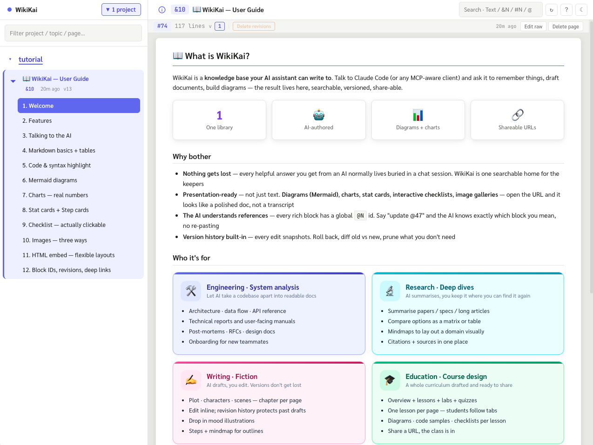
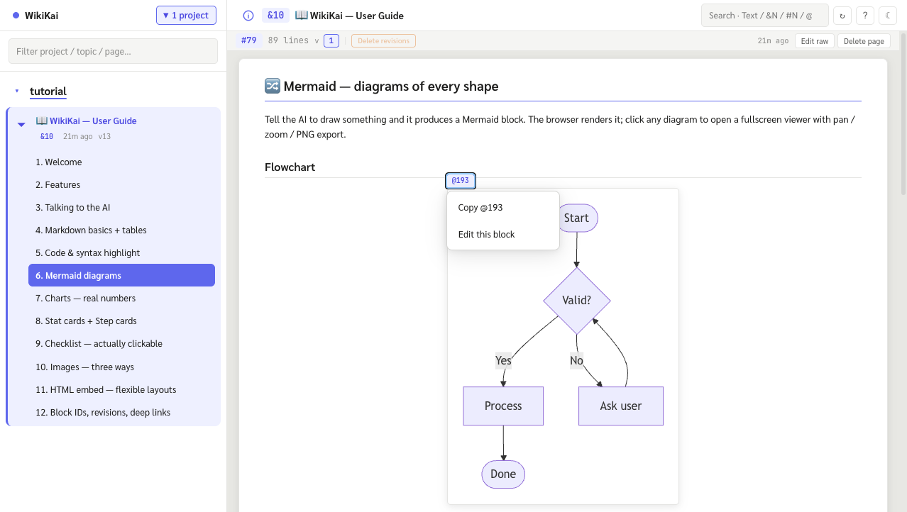
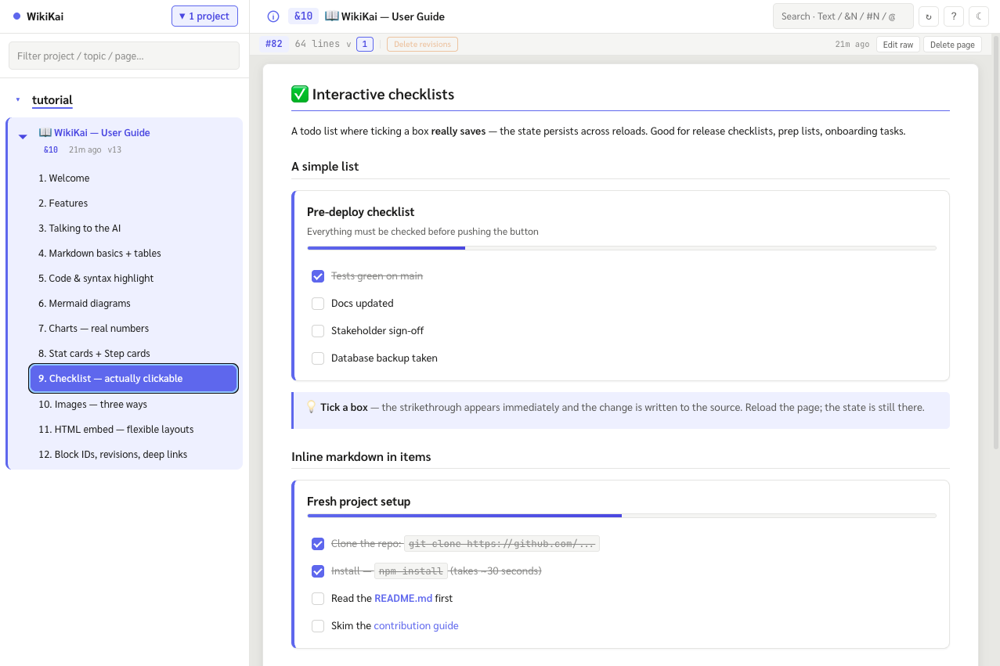

# WikiKai

[](LICENSE)
[](#requirements)
[](#tech-stack)

**WikiKai** is a self-hosted **knowledge base + MCP server** — let an AI assistant (Claude Code, Claude Desktop, or any MCP-aware client) write, edit, and recall presentation-ready documents for you. Markdown pages with Mermaid diagrams, Chart.js graphs, interactive checkboxes, image galleries, and stat cards. One persistent, searchable place — not scattered across chat sessions.

```
┌─ MCP client (Claude Code, …) ─┐         ┌──────── WikiKai server ────────┐
│                               │  HTTP   │  /mcp        ← MCP tools         │
│  25 tools: add_knowledge,     │ ──────► │  /api/*      ← REST for the UI   │
│  read_page, edit_section,     │         │  /           ← React SPA         │
│  add_image, toggle_task,      │         │  /mermaid/.. ← fullscreen viewer │
│  get_prompt_log, search, …    │         │  /chart/..   ← fullscreen viewer │
└───────────────────────────────┘         │  /img/<hash> ← image serving     │
                                          │                                  │
                                          │  SQLite (FTS5) + items/<id>.md   │
                                          │  + data/images/<2-prefix>/<hash> │
                                          └──────────────────────────────────┘
```

<p align="center">
  
</p>

## Why

Working with an AI day-to-day, every useful answer ends up buried in a chat session you can't search later. WikiKai gives the AI a persistent home to write to:

- **Doesn't get lost** — every doc lives in one searchable place, browsable in a sidebar
- **Presentation-ready** — diagrams, charts, KPI cards, step cards, gallery, interactive checkboxes — not just text walls
- **Re-editable** — every change is a version snapshot. Roll back, diff old vs new, prune history
- **Addressable** — every rich block **plus every plain markdown table** has a global `@N` id. Say "update @47" / "row 3 of @58" and the AI uses `get_block` / `get_table_row` / `find_table_rows` to act surgically without reading the whole page
- **Auditable** — opt-in prompt log records the verbatim request that produced each revision

## Features

### Content fences (server-rendered, browser-mounted)

| Fence | What it is |
|---|---|
| ` ```mermaid ` | Flowchart · sequence · ER · state · mindmap · pie. Click → fullscreen pan/zoom + PNG export |
| ` ```chart ` | Single Chart.js graph (bar/line/doughnut/…). Click → fullscreen + PNG export |
| ` ```chart-grid ` | Array of chart configs side-by-side |
| ` ```stats ` | Inline KPI card row with semantic colors |
| ` ```steps ` | Numbered step cards (markdown inline allowed inside `body`) |
| ` ```images ` | Thumbnail gallery → click-to-lightbox + per-image size |
| Plain `- [ ]` lists + cells | **Interactive checkboxes** — write a GFM task `- [ ] item` in any list, or drop `[ ]` / `[x]` directly into a markdown table cell; clicking writes back to source (version-bumped + revision-snapshotted) |
| Markdown tables | Get an `@N` id automatically; the AI can `get_table_row({ block_id, row_index })` or `find_table_rows({ block_id, filter })` to read one row without re-fetching the page |
| ` ```html-embed ` | Raw HTML for layouts markdown can't express — gradient cards, SVG, `<details>`, custom CSS. Embedded `<input type="checkbox">` is also clickable and write-backed |

Plus standard markdown with Shiki syntax highlighting for 30+ languages.

**Click `@N` → menu, edit a block, persist checkbox state** — every rich block is addressable and editable in two paces:

<p align="center">
  
  <br/><em>The <code>@N</code> badge appears on hover. Click it to copy the id (so you can say "update @193") or jump the editor straight to the block's source line.</em>
</p>

<p align="center">
  
  <br/><em>Interactive checkboxes persist — ticking a <code>- [ ]</code> box writes back to the source (page version bumped, revision snapshotted). The AI can drive the same toggle via the <code>toggle_task</code> tool.</em>
</p>

### Document model

```
Knowledge (&N)  ──┬── Page (#N) ──┬── Markdown content
                  │               │
                  │               └── Rich blocks (each gets @N)
                  │
                  ├── Project (group key, sidebar grouping)
                  ├── Tags, session_id, author
                  └── Revisions per page (snapshot on every change)
```

- **`&N`** — knowledge id (a whole document)
- **`#N`** — page id (a tab inside a knowledge)
- **`@N`** — global rich-block id (mermaid, chart, stats, …)
- **`:L`** — line number inside a page

URLs follow the same notation: `/&3/#12:42` opens knowledge `&3`, page `#12`, near line 42.

### MCP tool surface (25 tools)

**Knowledge** — `add_knowledge` · `edit_knowledge` · `list_knowledge` · `get_knowledge` · `delete_knowledge` · `get_outline`

**Pages** — `add_page` · `edit_page` · `append_page` · `delete_page` · `list_pages` · `reorder_pages`

**Surgical edits** — `read_page` (with hash) · `edit_lines` · `edit_section` (heading-anchored, preferred) · `replace_text`

**Search + discovery** — `search` (FTS5 trigram, Thai/CJK works) · `get_block` (fetch by `@N`) · `get_example` (templates with `outline_only` + slice modes) · `get_table_row` (one row of a table by `@N` + index) · `find_table_rows` (header-aware filter across a table without reading the whole page)

**Images** — `add_image` (base64 in, **or `path` to import a server-local file with zero base64** when `WIKIKAI_IMAGE_IMPORT_ROOTS` is set; content-addressed) · `get_image` (returns inline image content block)

**Interaction** — `toggle_task` (flip a plain `- [ ]` / `- [x]` task on a page — the same code path the web UI uses when a user clicks a rendered checkbox)

**Audit** — `get_prompt_log` (rolling list of user prompts that shaped a doc; mutation tools accept opt-in `user_prompt`)

Every mutation tool returns the affected entity's URL so the AI can hand a link straight to the user.

### Web portal

- Theme-aware (light / dark), Sarabun/IBM Plex Sans Thai for Thai content
- Sidebar grouped by project, with a filter dialog (and **add empty project / move knowledge** workflow)
- FTS-powered search across content / titles / keywords / block ids (`@47` direct lookup)
- Per-page version dropdown + line-level diff modal + prune-old-revisions
- Inline editor (CodeMirror 6) with **Add Images** dialog (file picker + drag-drop, context-aware insertion form)
- Info popover with project rename + prompt-log timeline
- Click `@N` badge → menu (Copy / Edit this block — jumps the editor straight to the block's source line)
- Bearer-token auth for `/mcp` (REST + portal are unprotected by design; gate at the reverse-proxy layer)

## Quick start

```bash
git clone https://github.com/<you>/wikikai.git
cd wikikai
npm install
npm run seed         # optional: creates a bundled "WikiKai — User Guide" tutorial doc
npm run dev          # server on :3939, Vite HMR on :5173
```

Open <http://localhost:5173> for the dev UI (HMR + proxied API), or <http://localhost:3939> for the production-built portal. If you ran `npm run seed`, the sidebar already has a 12-tab walkthrough with examples of every fence type.

### Hook it up to Claude Code

```jsonc
// ~/.claude/settings.json
{
  "mcpServers": {
    "wikikai": {
      "type": "http",
      "url": "http://localhost:3939/mcp"
    }
  }
}
```

Restart Claude Code; all 25 tools appear automatically. Try:

> Save what we just discussed as a knowledge titled "Postgres timeout fix", project "infra-notes".

> Open the document we made last week and append a new page called "Rollback procedure".

> Tick @118 item 1 — done.

### Install the Claude skill (recommended)

The MCP tools alone leave it to Claude to guess **when** to use WikiKai. A small skill file shipped in this repo at [`docs/skill/SKILL.md`](docs/skill/SKILL.md) gives Claude Code explicit triggers — "save this", "บันทึก", `&N` / `#N` references, the recommended creation / search / edit / reference workflows, and the do-/don't-list for token-efficient calls.

```bash
mkdir -p ~/.claude/skills/wikikai
cp docs/skill/SKILL.md ~/.claude/skills/wikikai/SKILL.md
# Or symlink so it stays in sync as you pull new versions:
#   ln -s "$(pwd)/docs/skill/SKILL.md" ~/.claude/skills/wikikai/SKILL.md
```

Restart Claude Code once more. The skill is announced at session start and will invoke itself when its keyword triggers fire — you can also force it with `/wikikai` if your client supports skill commands.

## Requirements

- **Node ≥ 20.12** (uses `process.loadEnvFile`)
- Native modules — `better-sqlite3`, `@rollup/rollup-*` — must be rebuilt against the active Node ABI when changing Node versions. Run `npm rebuild` after switching.

## Configuration

All settings come from env vars (or `.env` in the project root). See [`.env.example`](.env.example).

| Variable | Default | Purpose |
|---|---|---|
| `PORT` | `3939` | HTTP port |
| `HOST` | `0.0.0.0` | Bind address |
| `DATA_DIR` | `./data` | Where SQLite + items + images live |
| `DB_PATH` | `<DATA_DIR>/index.db` | SQLite file |
| `ITEMS_DIR` | `<DATA_DIR>/items` | Per-page raw markdown files |
| `PUBLIC_BASE_URL` | derived from HOST + LAN IP | URL surfaced in tool responses |
| `WIKIKAI_TOKEN` | unset | If set, `/mcp` requires `Authorization: Bearer <token>` |
| `WIKIKAI_WEB_AUTH` | `0` | If `1`, enables multi-user auth + per-project permissions (requires reverse-proxy for HTTPS + OAuth2) |
| `WIKIKAI_PROJECT_ACL` | `1` | If `0`, disables project permission enforcement (emergency rollback) |
| `WIKIKAI_IMAGE_IMPORT_ROOTS` | unset | Comma-separated absolute dirs. When set, `add_image({ path })` reads a local file off the server disk (no base64 → big token saving for same-machine images). Keep roots narrow — `/img` is unauthenticated. |

## Per-project permissions

When `WIKIKAI_WEB_AUTH=1`, non-admin users start with no access. An admin can open **Manage users → Edit → Project access** to grant `view` or `edit` per project. The grant applies to the web portal and to the user's MCP token equally. Set `WIKIKAI_PROJECT_ACL=0` to disable enforcement temporarily (emergency rollback).

## Tech stack

- **Server**: Node ≥ 20.12, TypeScript (strict), Express, `better-sqlite3` with SQLite FTS5 (trigram tokenizer for Thai/CJK), `@modelcontextprotocol/sdk` over Streamable HTTP, Zod, markdown-it, Shiki
- **Client**: React 18 + Redux Toolkit (RTK Query), Vite, CodeMirror 6 (inline editor), Mermaid 11, Chart.js 4
- **Tests**: Vitest + Supertest (100+ tests covering store, markdown rendering, REST routes, tool handlers)
- **No ORM** — `better-sqlite3` prepared statements are deliberate. The dependency list is intentionally short.

## URL scheme

| URL | Means |
|---|---|
| `/&3` | knowledge `&3`, first page (auto-picked) |
| `/&3/#12` | knowledge `&3`, page `#12` |
| `/&3/#12:42` | knowledge `&3`, page `#12`, scroll near line 42 |
| `/mermaid/12/0` | fullscreen viewer for the 1st mermaid block on page `#12` |
| `/chart/12/0` | fullscreen viewer for the 1st chart on page `#12` |
| `/img/<hash>.<ext>` | content-addressed image serving (immutable, cacheable forever) |

## Repository layout

```
src/
  index.ts            entry — loads .env then startServer()
  server.ts           wires config, stores, MCP, web app
  lib/config.ts       env → typed Config
  store/
    db.ts             SQLite connection + schema apply
    schema.sql        knowledge / pages / page_revisions / images / prompt_log / FTS5
    knowledge.ts      knowledge CRUD + project registry
    pages.ts          page CRUD, line ops, block id allocation + injection, FTS sync
    images.ts         content-addressed image storage
    promptLog.ts      rolling per-knowledge prompt log (capped at 500 chars)
  mcp/
    server.ts         registers all 25 tools on the MCP SDK
    handlers.ts       Zod schemas + tool implementations (single source of truth)
    examples/         markdown reference content served via get_example
  web/
    app.ts            Express routes — /api, /mcp, /mermaid, /chart, /img, static SPA
    mcpRoute.ts       Streamable HTTP transport + session map
    mermaidViewer.ts  standalone fullscreen Mermaid HTML (pan/zoom/PNG export)
    chartViewer.ts    standalone fullscreen Chart.js HTML (PNG export)
  render/markdown.ts  markdown-it pipeline with all custom fences

client/src/           React SPA (sidebar, tabs, viewer, search, editor, modals)
scripts/              one-shot scripts for seeding tutorials and migrations
test/                 vitest — knowledge / pages / markdown / web / tools / config
```

## Development

```bash
npm run dev          # tsx watch (server) + vite (HMR client), concurrent
npm run typecheck    # strict TS across both projects
npm test             # vitest
npm run build        # tsc + vite build → dist/ + client/dist/
npm start            # tsx src/index.ts (production-style, no watch)
npm run seed         # populate an empty DB with the bundled tutorial doc
```

The web UI is served two ways:
- `npm run dev`: client at <http://localhost:5173> (HMR), proxying `/api`, `/mcp`, `/mermaid`, `/chart`, `/img` to the server on `:3939`
- Production build: `client/dist/` served by Express on `:3939`

When editing UI, hit `:5173` for HMR. `:3939` serves the most recent `npm run build:client` output.

## Deployment

See [`DEPLOY.md`](DEPLOY.md) for systemd unit, nginx + TLS reverse proxy, data migration, and the bearer-token auth model.

## Roadmap

- [ ] Export knowledge to standalone HTML / PDF
- [ ] Tag autocomplete in the editor
- [ ] Multi-user authentication (today: single-tenant + reverse-proxy gate)
- [ ] Real-time collaborative editing
- [ ] Mobile-optimised sidebar

Feedback and PRs welcome — see [Contributing](#contributing).

## Contributing

This is an early-stage project; the surface evolves. If you find a bug or want to add a fence type / MCP tool:

1. Open an issue describing the use case first — keeps the dep list short and the tool surface coherent
2. Write a test (Vitest) — `npm test` must stay green
3. Match the existing conventions: Zod schemas in `mcp/handlers.ts` are the single source of truth, English-only tool descriptions, theme tokens for all colors, no `any` in new code
4. Update the in-app help (HelpModal, EN + TH) for user-visible changes

## Author

**Tharayuth Kaewma** — <tharayuth@gmail.com>

## License

[MIT](LICENSE) © 2026 Tharayuth Kaewma. Free for personal and commercial use; please keep the copyright notice.

## Acknowledgements

Built on the shoulders of [Anthropic's MCP](https://modelcontextprotocol.io/), [markdown-it](https://github.com/markdown-it/markdown-it), [Shiki](https://shiki.style/), [Mermaid](https://mermaid.js.org/), [Chart.js](https://www.chartjs.org/), [CodeMirror](https://codemirror.net/), and [better-sqlite3](https://github.com/WiseLibs/better-sqlite3).
