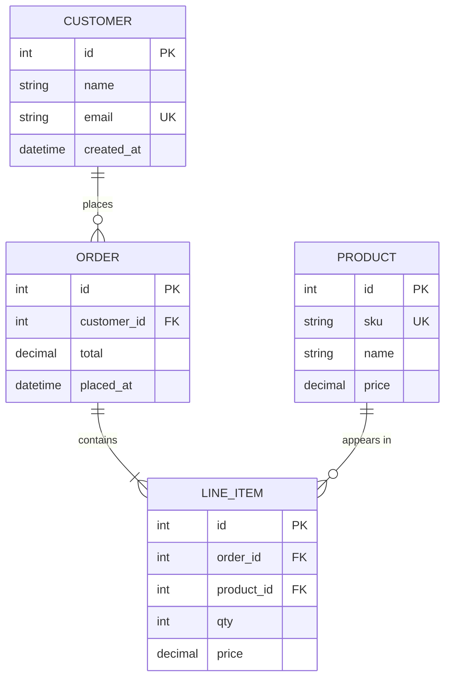

# ER Diagram Pattern

## Basic ER

## Tips

- ใช้ `||--o{` = one-to-many, `||--||` = one-to-one, `}o--o{` = many-to-many
- ใส่ `PK` / `FK` / `UK` หลัง column name สำหรับ primary / foreign / unique key
- คั่นความสัมพันธ์ด้วย label เช่น `: places`, `: contains` เพื่อให้อ่านง่าย
