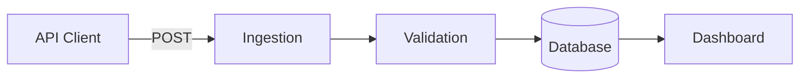
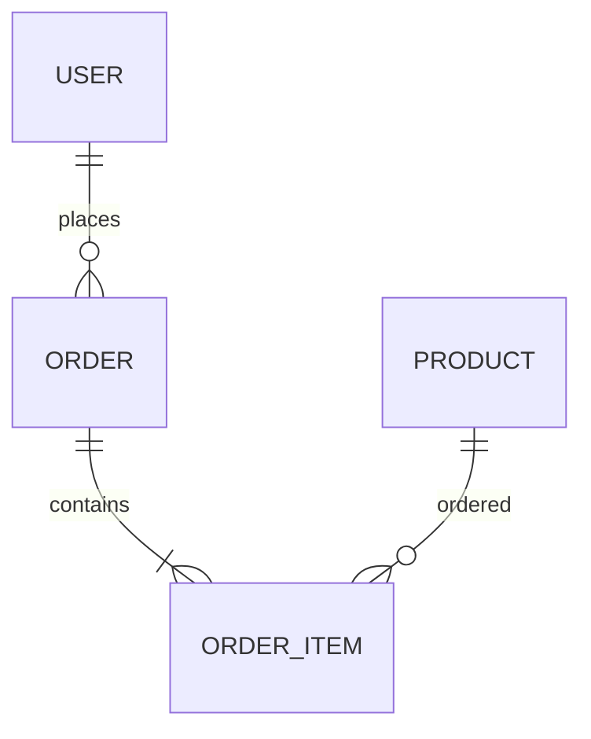

# Title — สรุปย่อ 1 บรรทัด

ย่อหน้าเปิดที่อธิบายว่าเอกสารนี้พูดเรื่องอะไร ใครควรอ่าน

## 1. ภาพรวม

ใช้ stats block สำหรับตัวเลขสำคัญ:

```stats
[
  { "num": "44K", "label": "Factories" },
  { "num": "164K", "label": "Datasets", "color": "blue" },
  { "num": "12.5GB", "label": "Storage", "color": "amber" },
  { "num": "99.9%", "label": "Uptime", "color": "green" }
]
```

## 2. Architecture



## 3. ER Diagram



## 4. Performance

```chart
{
  "type": "bar",
  "data": {
    "labels": ["Q1","Q2","Q3","Q4"],
    "datasets": [
      { "label": "Revenue (M฿)", "data": [12, 19, 7, 15], "backgroundColor": "#6366f1" }
    ]
  },
  "options": { "responsive": true }
}
```

## 5. ตารางเปรียบเทียบ

| Feature       | A   | B   | C   |
|---------------|-----|-----|-----|
| Performance   | ✅  | ⚠️  | ✅  |
| Cost          | $   | $$  | $$$ |
| Setup time    | 1d  | 3d  | 1w  |

## 6. Code Example

```typescript
async function fetchData(id: number) {
  const r = await fetch(`/api/items/${id}`);
  return r.json();
}
```

## 7. สรุป

- จุดสำคัญ 1
- จุดสำคัญ 2
- จุดสำคัญ 3
