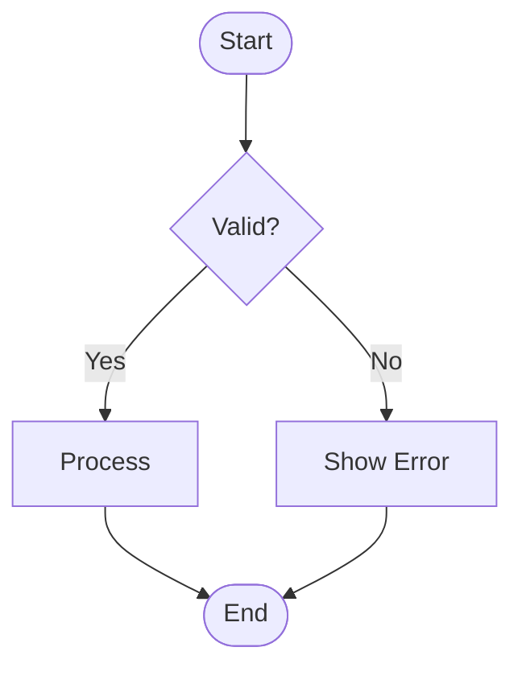
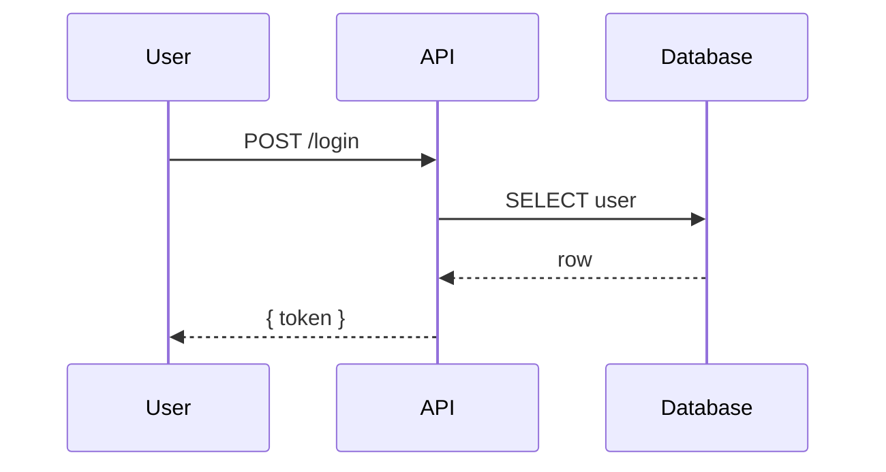
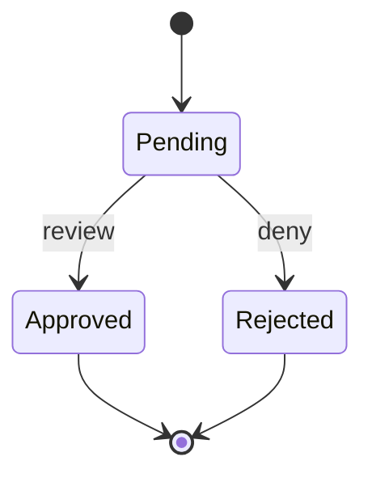
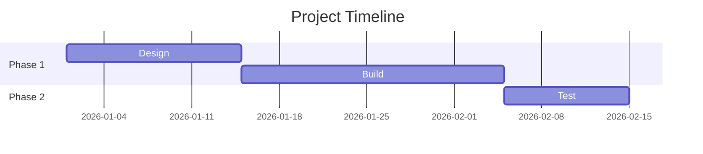

# Mermaid Diagrams Cheatsheet

## Flowchart

```mermaid
flowchart TD
  Start([Start]) --> Check{Valid?}
  Check -->|Yes| Process[Process]
  Check -->|No| Error[Show Error]
  Process --> End([End])
  Error --> End
```

## Sequence Diagram

```mermaid
sequenceDiagram
  participant U as User
  participant A as API
  participant DB as Database
  U->>A: POST /login
  A->>DB: SELECT user
  DB-->>A: row
  A-->>U: { token }
```

## State Diagram

```mermaid
stateDiagram-v2
  [*] --> Pending
  Pending --> Approved: review
  Pending --> Rejected: deny
  Approved --> [*]
  Rejected --> [*]
```

## Gantt

```mermaid
gantt
  title Project Timeline
  dateFormat YYYY-MM-DD
  section Phase 1
  Design     :a1, 2026-01-01, 14d
  Build      :a2, after a1, 21d
  section Phase 2
  Test       :a3, after a2, 10d
```
